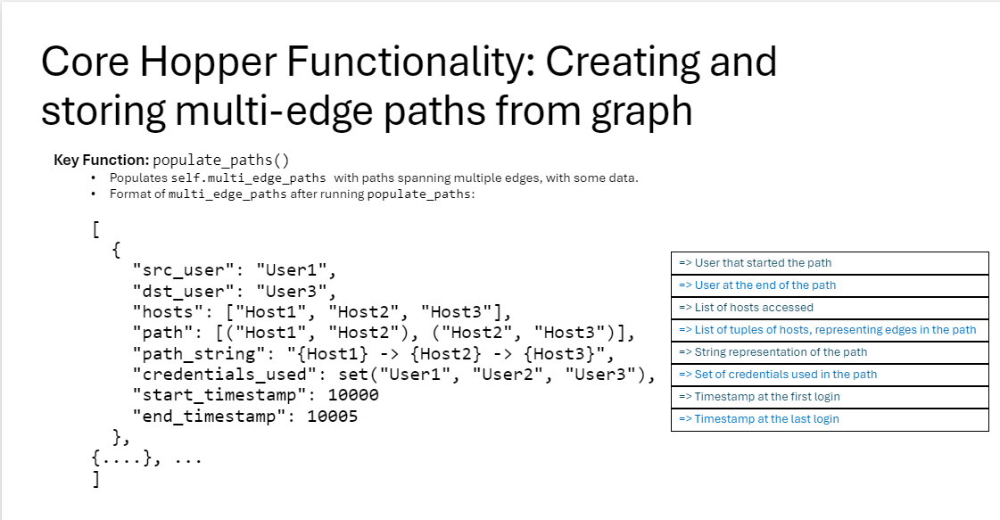
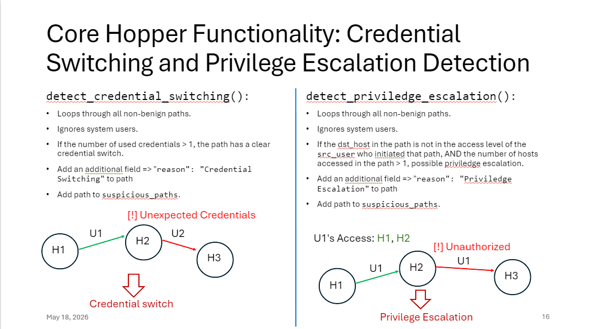
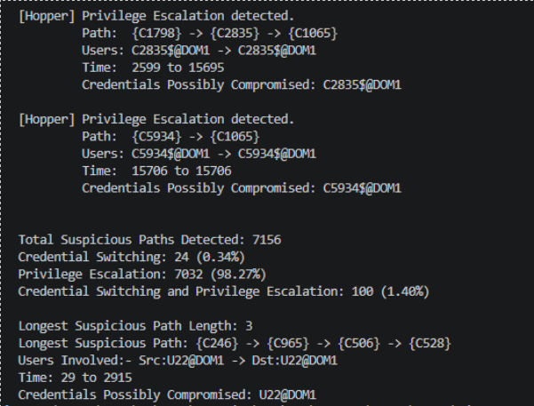
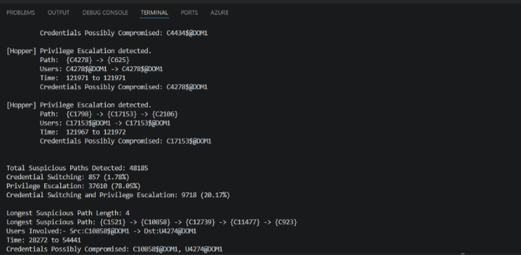

# Specificaiton-Guided Lateral Movement Detectiong using eBPF
## CSCI4271-win26-Group2
Nir Kazatsker

Miriam Okutuo

Manveer Singh Pabla

Amogh Sharma

Setup instructions: 
```
# Clone the repository
git clone https://github.com/PINetDalhousie/CSCI4271-win26-Group2.git

# install dependencies:
pip install -r requirements.txt

# install BCC from the BCC Github.
```

## Instructions to run the project
There are two ways to run this project. 

1. Deploy the system on a simulated network (Mininet).

Step 1. Deploy the default mininet topology using `sudo mn`.

Step 2. Open two terminal windows into the hosts using `xterm h1 h2`. 

Step 3. In the terminal window for h2, start the hopper program using `python3 hopper.py`

Step 4. In the terminal window for h1, send packets to hopper using `python3 sendPackets.py`

Step 5. Once `sendPackets.py` finishes running, press `Control C` (or your Interrupt Key) to process graph results. 

The traffic simulation may take multiple hours to days depending on how much data you are processing, which is why we recommended for evaluating the algorithm to use the second method. 

2. Only evaluating the algorithm. **Only this can be done in the repository since it only contains the Hopper, data cleaning and graph generation functionality**

Step 1. Run `hopperPrototypeTest.py` directly using `python3 hopperPrototypeTest.py`

This will clean the data, run the detection algorithm and output results of the algorithm.

All data is located in the folder `auth/`. If you want to change which data you want evaluated, modify `cleanData.py` top for loop to indicate the range of dataset you want to run. 


---------

### Dataset information:

The relevant dataset in its entirety can be downloaded [here](https://dalu.sharepoint.com/:u:/t/TAChannel-CSCI6709-SDN/IQDuJrmO8RbFRY7iJP-TGV4GATdkiYFvqx9Abet5lVYO7XY?e=p4Hoof)

The first portion is included here divided into 15 100MB files, the largest possible for GitHub.

---------

### Methodology (Hopper):

The Hopper class utilizes these variables for malicious lateral movement detection: 

- **self.graph:** The NetworkX DiGraph that is given as input when initializing the class 

- **self.access_threshold:** A range object which stores the threshold of weights that a path needs for it to be in the access threshold of a user. This is computed using the self.set_access_threshold function, which computes the Interquartile Range of all weights. 

- **self.multi_edge_paths:** A list of dictionaries, where each dictionary represents a path, which is an aggregate of multiple edges in the DiGraph. This object is pivotal to our detection logic and is created by the self.populate_paths method. Its structure is of the format: 

  
_Figure 2: Dictionary example representing login paths_ 

- **self.not_benign_paths:** This is a list of paths, of the same format as self.multi_edge_paths above, which are not considered benign. It is populated by the benign_checker() method. 

- **self.suspicious_paths:** This is a list of paths, of the same format as self.multi_edge_paths, but with another key-value pair about reason the path was flagged as malicious, containing all the detected suspicious paths in our login graph. It is returned after detection finishes. 

- **self.user_access_levels:** This is a dictionary where the users are stored as string keys, with a set() of hosts they can access as the corresponding values. This object is populated by the populate_user_access_levels() method of the Hopper class. 

- **self.MAX_PATH_LENGTH:** This variable limits the maximum length of paths we will consider for our detection. Increasing it will increase computational cost, but longer paths will be considered, and vice versa. 

- **self.MIN_PATH_LENGTH:** This variable limits the minimum length of the paths we will consider for our detection. Paths shorter than this will not be checked. 

---------

### Implementation (Hopper):

The main detection logic is stored in the hopperPrototype.py file. This file contains our main Hopper class, which takes in a NetworkX Directed Graph as input into the __init__ method. Upon initialization, the Hopper object stores the input graph in a private self.graph variable. 

In the init method, the set_access_threshold() is also called which sets the self.access_threshold private variable to a range of numbers. This range is calculated by finding the 50% Interquartile Range (IQR) of all the weights of the edges in the graph. IQR is used here since it is robust against outliers. The weights for the edges in the graph can vary, with edges having high weights like 700, and most other edges having low weights such as 3. IQR is used to make sure we set our access threshold to the 50% of all the values of the weights, through computing the range from the 25th to the 75th quartile of weights. 

To begin detection, the detect() method from the class is called, which then runs the following methods in order and completes a full lateral movement detection on the input graph: 

- **self.populate_user_access_levels:** This method goes through all edges in the graph and populates our dictionary of user access levels: self.user_access_levels. Here, we store users as keys, with the hosts they have access to in a set() as the value. 

- **self.populate_paths:** This is a key method used in the detection logic. It identifies and creates multi-edge paths in our login graph and stores their information within the self.multi_edge_paths list. Each path is a dictionary of values as given in the methodology. 

- **self.benign_checker:** This function compares the details of each path from multi_edge_paths against certain parameters that have been tuned to give the optimal results specifically for our case. If the comparisons determine that a path is not benign, then the function adds those paths to the array not_benign_paths. 

- **self.detect_credential_switching:** This is the first malicious detection function that uses the not_benign_paths list of paths, which has the same structure as self.multi_edge_paths. It simply checks if for each path, the number of credentials used in it is more than 1. If so, the path is flagged as credential switching. Then, it creates a copy object containing information about the path, along with the reason for flagging, listed as “Credential Switching” and adds it to self.suspicious_paths. 

- **self.detect_privilege_escalation:** This function is used for detecting the second property of Privilege Escalation, as described in [1]. For each path, it flags a path to contain Privilege Escalation if the final host accessed in the path is not in the access levels of the src_user that first initialized the multi-edge path. If such a path is found, it creates a copy object of the path with its details along with the reason for flagging being “Privilege Escalation” and then adds the copy to self.suspicious_paths. 

  
_Figure 3: How suspicious paths are detected_ 

- **self.filter_duplicate_paths:** This function is the first cleaning function that filters out any duplicate paths from self.suspicous_paths. 

- **self.filter_redundant_paths:** This is the second cleaning function applied to self.suspicous_paths. It filters out any shorter paths that have longer counterparts. For Example, if self.suspicious_paths contains a path A -> B -> C that is suspicious, and has a path A -> B that is suspicious with the same reason, then we filter out the path A -> B, keeping A -> B -> C. 

- **self.combine_path_reasons:** This is the final cleaning function applied to self.suspicious_paths. This was recently added because we noticed a lot of paths with credential switching also having privilege escalation. Due to this, our list of suspicious paths contained duplicate paths where the only difference was that one path had its reason listed as Credential Switching, while the other had Privilege Escalation. To reduce this redundancy, the self.combine_path_reasons function combines the two reasons into a third reason “Credential Switching and Privilege Escalation” and filters out the duplicates.  

- **self.is_system_user:** This is a simple string checking function that checks if the input user is a system user, by checking if their username begins with SYSTEM or LOCAL SERVICE. 

---------

### Experimental Results 

For experiments 1 and 2, we utilized the hopperPrototypeTest.py file, which emulates what the eBPF program does, by calling the data cleaning and graphing functions to populate the login graph and creating a Hopper object to run the detection.

1. **Input:** authx00 

   **Path Bounds:** MIN_PATH_LENGTH = 2 & MAX_PATH_LENGTH = 10 

    In the results of the detection on one of our login data files, our Hopper program detected a total of 7156 suspicious logins. We see that the majority of the suspicious logins (a whopping 98%) were flagged due to having Privilege Escalation, followed by both Credential Switching and Privilege Escalation (1.40%) and just Credential Switching (0.34%). The longest path we see in the data has 3 edges. 

      
    _Figure 4: Detection Results for authx00_  

2. **Input:** authx01 to authx10 

   **Path Bounds:** MIN_PATH_LENGTH = 2 & MAX_PATH_LENGTH = 10 

    With the 10 login data files as input, the program takes quite a bit of time to run due to the volume of the data. In the results, we see a similar trend to the above test. Out of the total 48,185 detected suspicious paths, the number of paths detected is dominated by Privilege Escalation paths (70.05%), followed by paths containing both Credential Switching and Privilege Escalation (20.17%) and lastly, paths that contain only Credential Switching (1.78%). This time, the longest path found contains 4 edges. 

      
    _Figure 5: Detection Results for authx01 to authx10_  

    _authx01 to authx10 are not in the repo due to GitHub's space constraints_

---------